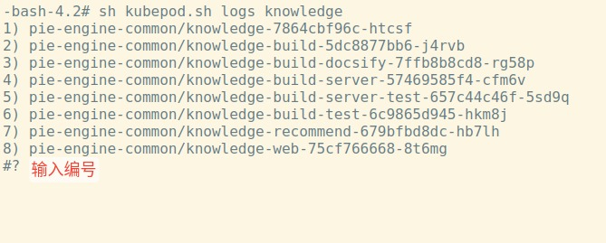

# kubepod.sh

`kubepod.sh` 基于`kubectl` 命令封装，操作k8s的脚本，可以安全高效的访问k8s。只提供对k8s的访问命令，不提供删除的操作

`kubepod.sh` 支持以下操作

## 查看日志

```shell
sh kubepod.sh logs {POD_NAME}
```

> 等同于 kubectl logs -f -n {podname}
>
> 该命令支持`podname`模糊匹配，如果匹配到多个容器，直接输入序号



```shell
-bash-4.2# sh kubepod.sh logs knowledge
1) pie-engine-common/knowledge-7864cbf96c-htcsf
2) pie-engine-common/knowledge-build-5dc8877bb6-j4rvb
3) pie-engine-common/knowledge-build-docsify-7ffb8b8cd8-rg58p
4) pie-engine-common/knowledge-build-server-57469585f4-cfm6v
5) pie-engine-common/knowledge-build-server-test-657c44c46f-5sd9q
6) pie-engine-common/knowledge-build-test-6c9865d945-hkm8j
7) pie-engine-common/knowledge-recommend-679bfbd8dc-hb7lh
8) pie-engine-common/knowledge-web-75cf766668-8t6mg
#? 1
kubectl logs -f -n pie-engine-common knowledge-7864cbf96c-htcsf
```

## 进入容器

```shell
sh kubepod.sh exec {POD_NAME}
```

> 等同于 kubectl exec -it -n {podname} /bin/bash
>
> 该命令支持`podname`模糊匹配，如果匹配到多个容器，直接输入序号

## 查看服务部署的端口

```shell
sh kubepod.sh svc {POD_NAME}
```

> 等同于 kubectl get svc -A | grep {podname}

## 查看Pod的状态

```shell
sh kubepod.sh desc {POD_NAME}
```

> 等同于 kubectl describe pod -n {podname}
>
> 该命令支持`podname`模糊匹配，如果匹配到多个容器，直接输入序号


## 查看Pod列表

```shell
sh kubepod.sh pods
```

> 等同于 kubectl get pods -A

## 查看Svc列表

```shell
sh kubepod.sh svcs
```

> 等同于 kubectl get svc -A

## 查看Deployment列表

```shell
sh kubepod.sh deploys
```

> 等同于 kubectl get deployments -A